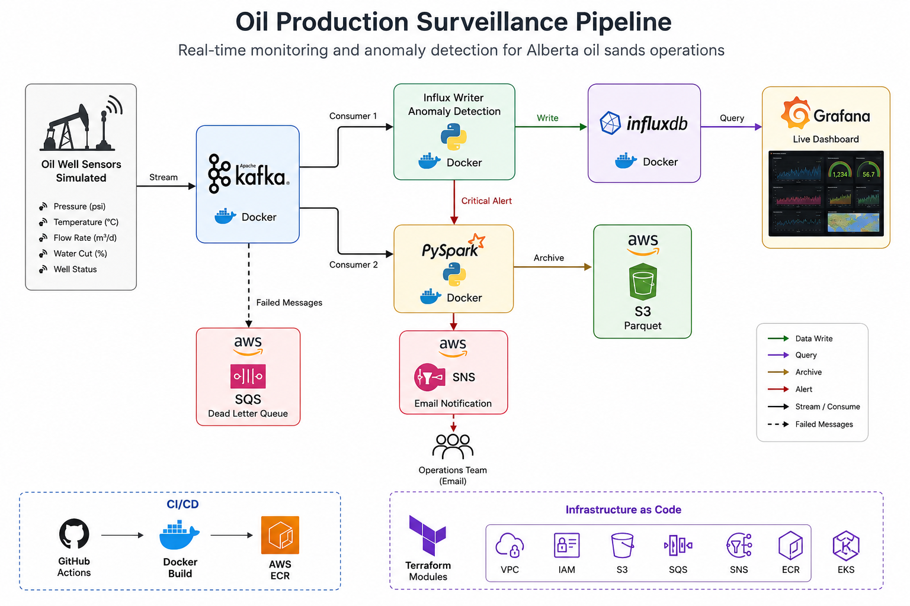
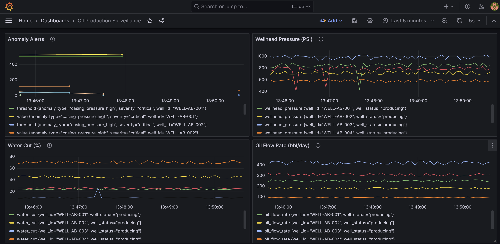
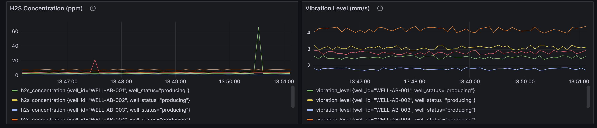

# Oil Production Surveillance Pipeline

A real-time data engineering pipeline that monitors oil well sensor data from simulated Alberta oil sands operations. The system ingests streaming data via Kafka, detects anomalies in well production metrics, archives data to S3, visualizes live dashboards in Grafana, and alerts operations teams via SNS when critical thresholds are breached.

## Architecture



## Tech Stack

| Component | Technology | Purpose |
|-----------|-----------|---------|
| Message Broker | Apache Kafka | Real-time data streaming |
| Stream Processing | PySpark Structured Streaming | Batch archiving to S3 |
| Time-Series DB | InfluxDB | Fast queries for live dashboards |
| Visualization | Grafana | Live ECG-style monitoring dashboards |
| Object Storage | AWS S3 | Long-term data archive (parquet format) |
| Alerting | AWS SNS | Email notifications for critical anomalies |
| Dead Letter Queue | AWS SQS | Failed message recovery |
| Container Registry | AWS ECR | Docker image storage |
| Infrastructure | Terraform (modules) | Infrastructure as Code |
| CI/CD | GitHub Actions | Automated build, deploy, push to ECR |
| Containerization | Docker Compose | Local development orchestration |

## Project Structure

```
oil-production-surveillance/
├── .github/workflows/
│   └── ci-cd.yml                 # CI/CD pipeline (Terraform + Docker build + ECR push)
├── alerting/
│   └── alert_handler.py          # SNS alert logic for critical anomalies
├── grafana/
│   └── provisioning/
│       └── datasources/
│           └── datasource.yml    # Auto-configures InfluxDB as Grafana datasource
├── scripts/
│   ├── extract/
│   │   ├── well_data_producer.py # Simulates oil well sensor data → Kafka
│   │   ├── well_baselines.json   # Well configuration (separated from code)
│   │   └── anomaly_injector.py   # Injects realistic anomalies into simulated data
│   ├── transform/
│   │   └── anomaly_detection.py  # Transformation logic
│   └── load/
│       └── influx_writer.py      # Kafka → InfluxDB + anomaly detection + SNS alerts
├── spark_jobs/
│   ├── stream_processor.py       # PySpark streaming job (Kafka → S3)
│   └── utils/
│       └── spark_functions.py    # Reusable Spark functions
├── terraform/
│   ├── env/
│   │   ├── dev/                  # Dev environment config
│   │   ├── test/                 # Test environment config
│   │   └── prod/                 # Prod environment config
│   └── module/
│       └── oil-surveillance/     # Shared Terraform module (S3, SNS, SQS, ECR)
├── config.yml                    # Centralized application config
├── docker-compose.yml            # All services (Kafka, Spark, InfluxDB, Grafana)
├── Dockerfile                    # Pipeline app container image
└── requirements.txt              # Python dependencies
```

## How to Run Locally

### Prerequisites

- Docker Desktop
- Python 3.13+
- Java 17 (for PySpark)
- AWS account with free tier

### Step 1: Start infrastructure

```bash
docker-compose up -d
```

This starts: Zookeeper, Kafka, InfluxDB, Grafana, Spark Master, Spark Worker. The Kafka topic is auto-created by the `kafka-init` container.

### Step 2: Set environment variables

```bash
export AWS_ACCESS_KEY_ID="your-key"
export AWS_SECRET_ACCESS_KEY="your-secret"
export AWS_DEFAULT_REGION="eu-west-2"
export SNS_TOPIC_ARN="arn:aws:sns:eu-west-2:ACCOUNT_ID:oil-surveillance-alerts-dev"
export SQS_QUEUE_URL="https://sqs.eu-west-2.amazonaws.com/ACCOUNT_ID/oil-surveillance-dlq-dev"
```

### Step 3: Activate virtual environment and install dependencies

```bash
python -m venv venv
source venv/bin/activate  # Linux/Mac
.\venv\Scripts\Activate   # Windows
pip install -r requirements.txt
```

### Step 4: Start the producer

```bash
python scripts/extract/well_data_producer.py
```

### Step 5: Start the InfluxDB writer

```bash
python scripts/load/influx_writer.py
```

### Step 6: Open Grafana dashboard

Navigate to http://localhost:3000 (admin / admin12345). Create dashboards using Flux queries against the `well-data-dev` bucket.

### Step 7: Run PySpark job (inside Docker)

```bash
docker exec -u 0 -it spark pip install pyyaml
docker exec -u 0 -it spark /opt/spark/bin/spark-submit \
  --packages org.apache.spark:spark-sql-kafka-0-10_2.12:3.5.0,org.apache.hadoop:hadoop-aws:3.3.4 \
  /opt/spark-jobs/stream_processor.py
```

## Monitoring & Alerting

### Well Anomaly Alerts (SNS)

Critical anomalies trigger email notifications:

| Condition | Threshold | Severity |
|-----------|-----------|----------|
| H2S concentration | > 10 ppm | Critical |
| Vibration level | > 8 mm/s | Critical |
| Wellhead pressure | < 400 PSI | Critical |
| Motor current | < 1 amp | Critical |
| Casing pressure | > 500 PSI | Critical |
| Water cut | > 85% | Warning |
| Sand rate | > 40 pptb | Warning |

### Pipeline Failure Alerts

- CI/CD pipeline failure → SNS email with run ID and link
- Producer crash → SNS email with error details
- Influx writer crash → SNS email with error details

### Dead Letter Queue (SQS)

If the producer cannot reach Kafka, failed messages are sent to SQS for later replay. This ensures zero data loss during Kafka outages.

## Grafana Dashboards

The dashboard is **auto-provisioned** — it loads automatically when Grafana starts. No manual setup required. Once the producer and influx_writer are running, data appears within seconds.

Login: `http://localhost:3000` (admin / admin12345) → Dashboards → "Oil Production Surveillance"

Live ECG-style dashboards with 5-second auto-refresh:





- **Wellhead Pressure (PSI)** — pressure monitoring across all wells
- **Oil Flow Rate (bbl/day)** — production output per well
- **Vibration Level (mm/s)** — equipment health indicator
- **H2S Concentration (ppm)** — safety-critical gas monitoring
- **Water Cut (%)** — reservoir health indicator
- **Anomaly Alerts** — table of detected anomalies with severity

## Infrastructure (Terraform)

Terraform modules create per-environment resources:

| Resource | Naming Pattern | Purpose |
|----------|---------------|---------|
| S3 Bucket | `oil-surveillance-{env}` | Parquet data archive |
| SNS Topic | `oil-surveillance-alerts-{env}` | Alert notifications |
| SQS Queue | `oil-surveillance-dlq-{env}` | Dead letter queue |
| ECR Repository | `oil-surveillance-{env}` | Docker image registry |

State is stored in S3 with DynamoDB locking to prevent concurrent modifications.

### Deploying infrastructure

```bash
cd terraform/env/dev
terraform init -backend-config="region=eu-west-2"
terraform apply -var="alert_email=your@email.com"
```

## CI/CD Pipeline

GitHub Actions workflow:

| Trigger | Environment | Actions |
|---------|-------------|---------|
| Push to `feature/*` | dev | Terraform Plan + Apply, Docker Build + Push to ECR |
| PR to `main` | prod | Terraform Plan only (review) |
| Merge to `main` | prod | Terraform Plan + Apply, Docker Build + Push to ECR |
| Manual trigger | any | Terraform Plan + Apply, Docker Build + Push to ECR |

## Decisions & Tradeoffs

| Decision | Why |
|----------|-----|
| Parquet over CSV | Columnar format: 10x smaller, faster analytical queries, schema enforcement |
| InfluxDB over PostgreSQL | Purpose-built for time-series: faster range queries, built-in retention policies |
| Two Kafka consumers | Separation of concerns: influx_writer for real-time dashboards, Spark for batch archiving |
| Environment variables for secrets | No credentials in code; works locally and in CI/CD without changes |
| DynamoDB for state locking | Atomic conditional writes prevent concurrent Terraform operations |
| Pinned Docker image versions | Reproducible builds; prevents unexpected breaking changes |
| Kafka auto-create topics disabled | Explicit topic management; prevents accidental topic creation by misconfigured producers |

## Production Considerations

In a production deployment, the following changes would apply:

| Component | Local (this project) | Production |
|-----------|---------------------|------------|
| Kafka | Docker container | AWS MSK (Managed Streaming for Kafka) |
| Spark | Docker container | AWS EMR or AWS Glue |
| InfluxDB | Docker container | InfluxDB Cloud or Amazon Timestream |
| Grafana | Docker container | Grafana Cloud or self-hosted on ECS |
| Pipeline app | Local Python scripts | ECS containers with IAM task roles |
| Credentials | Environment variables | IAM roles (no keys needed) |
| Scaling | Single node | Auto-scaling based on Kafka lag |

The PySpark job is designed to run on AWS EMR in production. Docker is used here to demonstrate the pipeline end-to-end without incurring compute costs.

## Sensor Data Schema

The pipeline monitors 19 sensor readings per well:

| Metric | Unit | What it indicates |
|--------|------|-------------------|
| oil_flow_rate | bbl/day | Production output |
| gas_flow_rate | mcf/day | Associated gas production |
| water_flow_rate | bbl/day | Unwanted water production |
| wellhead_pressure | PSI | Surface pressure |
| bottomhole_pressure | PSI | Reservoir pressure |
| casing_pressure | PSI | Well integrity |
| tubing_pressure | PSI | Production tubing condition |
| wellhead_temperature | °C | Surface temperature |
| bottomhole_temperature | °C | Downhole temperature |
| choke_size | /64 inch | Flow control valve |
| water_cut | % | Water-to-total-fluid ratio |
| gas_oil_ratio | scf/bbl | Gas per barrel of oil |
| pump_speed | SPM | Pump strokes per minute |
| motor_current | amps | Pump motor electrical draw |
| vibration_level | mm/s | Equipment vibration |
| sand_rate | pptb | Sand production |
| h2s_concentration | ppm | Toxic gas (safety critical) |

## License

MIT
